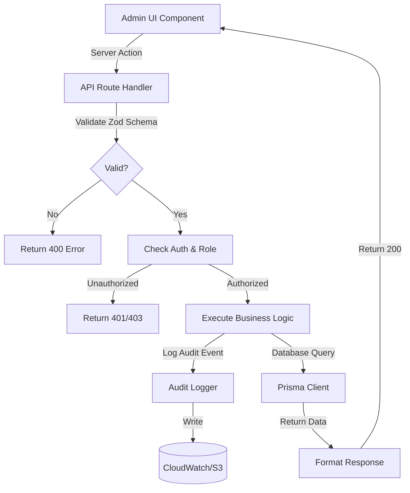

# Technical Requirements Document (TRD)
# Balisan Admin Portal

**Version:** 1.0  
**Date:** 2025-12-30  
**Author:** Engineering Team  
**Status:** DRAFT

## 1. Executive Summary

The Balisan Admin Portal is a desktop-first, efficiency-focused internal operations portal for managing the Balisan Liquor Store's e-commerce operations. Built using Next.js 14 App Router with React Server Components, the portal enables staff to manage products, process orders, maintain regulatory compliance, and monitor business metrics.

**Key Technical Objectives:**
- Zero impact on consumer-facing routes via architectural separation
- Sub-2-minute order processing workflow
- 100% inventory accuracy through optimistic locking
- Complete audit trail for compliance requirements
- Role-based access control with 4 permission levels

## 2. System Architecture

### 2.1 Route Structure

```
src/app/
├── (admin)/                    # Admin route group
│   ├── layout.tsx             # Admin-specific layout
│   ├── dashboard/
│   ├── products/
│   ├── orders/
│   ├── inventory/
│   ├── customers/
│   └── compliance/
├── (shop)/                     # Consumer routes (existing)
└── api/
    └── admin/                  # Admin API routes
        ├── products/
        ├── orders/
        ├── inventory/
        ├── compliance/
        └── audit-logs/
```

**Architectural Principles:**
- **Code Splitting**: Admin code must be in separate chunks, never loaded on consumer routes
- **Layout Isolation**: Admin layout replaces consumer Header/Footer with persistent sidebar
- **Style Scoping**: Admin styles use distinct CSS classes to prevent leakage
- **Data Separation**: Admin API routes use `/api/admin/*` namespace

### 2.2 Technology Stack

| Layer         | Technology                 | Justification                                 |
| ------------- | -------------------------- | --------------------------------------------- |
| Framework     | Next.js 14.1+ (App Router) | Server Components for data-heavy admin views  |
| Language      | TypeScript 5+              | Type safety for complex admin operations      |
| UI Components | shadcn/ui                  | Accessible, composable, already integrated    |
| Data Tables   | @tanstack/react-table      | Server-side pagination, sorting, filtering    |
| Forms         | react-hook-form + Zod      | Validation, type-safe schemas                 |
| Charts        | Recharts                   | Lightweight, React-native charting            |
| State         | Zustand                    | Lightweight global state (filter persistence) |
| ORM           | Prisma (future)            | Type-safe database queries                    |
| Styling       | Tailwind CSS 4             | Utility-first, existing setup                 |

### 2.3 Data Flow



## 3. Database Schema Requirements

### 3.1 Admin-Specific Tables

**AdminUsers**
```prisma
model AdminUser {
  id            String   @id @default(cuid())
  email         String   @unique
  name          String
  role          Role
  permissions   String[] // JSON array
  passwordHash  String
  mfaEnabled    Boolean  @default(false)
  mfaSecret     String?
  lastLogin     DateTime?
  createdAt     DateTime @default(now())
  updatedAt     DateTime @updatedAt
  auditLogs     AuditLog[]
}

enum Role {
  SUPER_ADMIN
  MANAGER
  STAFF
  AUDITOR
}
```

**AuditLogs**
```prisma
model AuditLog {
  id           String   @id @default(cuid())
  userId       String
  user         AdminUser @relation(fields: [userId], references: [id])
  action       String   // e.g., "UPDATE_PRODUCT_PRICE"
  resource     String   // e.g., "Product"
  resourceId   String
  changes      Json     // Before/after values
  ipAddress    String
  userAgent    String
  timestamp    DateTime @default(now())
  
  @@index([userId, timestamp])
  @@index([resource, resourceId])
  @@index([timestamp])
}
```

**ComplianceVerifications**
```prisma
model ComplianceVerification {
  id              String   @id @default(cuid())
  userId          String
  user            User     @relation(fields: [userId], references: [id])
  documentType    DocumentType
  documentImages  String[] // S3 URLs
  status          VerificationStatus
  reviewedBy      String?
  reviewedById    String?
  reviewer        AdminUser? @relation(fields: [reviewedById], references: [id])
  reviewNotes     String?
  reviewedAt      DateTime?
  createdAt       DateTime @default(now())
  
  @@index([status, createdAt])
}

enum DocumentType {
  ID
  PASSPORT
  DRIVERS_LICENSE
}

enum VerificationStatus {
  PENDING
  APPROVED
  REJECTED
}
```

**InventoryAdjustments**
```prisma
model InventoryAdjustment {
  id              String   @id @default(cuid())
  productId       String
  product         Product  @relation(fields: [productId], references: [id])
  quantityChange  Int
  reason          AdjustmentReason
  notes           String
  performedBy     String
  performedById   String
  admin           AdminUser @relation(fields: [performedById], references: [id])
  timestamp       DateTime @default(now())
  
  @@index([productId, timestamp])
}

enum AdjustmentReason {
  DAMAGE
  THEFT
  RETURN
  RESTOCK
  CORRECTION
}
```

### 3.2 Extended Existing Tables

**Products** (add version field for optimistic locking)
```prisma
model Product {
  // ... existing fields
  version       Int      @default(0)  // Incremented on each update
}
```

**Orders** (add admin-specific fields)
```prisma
model Order {
  // ... existing fields
  verificationStatus VerificationStatus @default(PENDING)
  fulfillmentStatus  FulfillmentStatus  @default(PENDING)
  timeline           OrderTimelineEvent[]
}

model OrderTimelineEvent {
  id           String   @id @default(cuid())
  orderId      String
  order        Order    @relation(fields: [orderId], references: [id])
  status       String
  note         String?
  performedBy  String
  timestamp    DateTime @default(now())
}

enum FulfillmentStatus {
  PENDING
  PROCESSING
  READY
  PICKED_UP
  DELIVERED
}
```

## 4. Security Requirements

### 4.1 Authentication & Authorization

**Role-Based Access Control (RBAC) Matrix:**

| Resource               | SUPER_ADMIN | MANAGER | STAFF | AUDITOR |
| ---------------------- | ----------- | ------- | ----- | ------- |
| Dashboard              | Read        | Read    | Read  | Read    |
| Products - View        | ✅           | ✅       | ✅     | ❌       |
| Products - Create/Edit | ✅           | ✅       | ❌     | ❌       |
| Products - Delete      | ✅           | ❌       | ❌     | ❌       |
| Products - Bulk Update | ✅           | ✅       | ❌     | ❌       |
| Orders - View          | ✅           | ✅       | ✅     | ❌       |
| Orders - Process       | ✅           | ✅       | ✅     | ❌       |
| Orders - Refund        | ✅           | ✅       | ❌     | ❌       |
| Inventory - View       | ✅           | ✅       | ✅     | ❌       |
| Inventory - Adjust     | ✅           | ✅       | ❌     | ❌       |
| Customers - View       | ✅           | ✅       | ❌     | ❌       |
| Customers - Edit       | ✅           | ❌       | ❌     | ❌       |
| Compliance - View      | ✅           | ✅       | ❌     | ✅       |
| Compliance - Review    | ✅           | ✅       | ❌     | ❌       |
| Audit Logs - View      | ✅           | ❌       | ❌     | ✅       |
| Audit Logs - Export    | ✅           | ❌       | ❌     | ✅       |
| Admin Users - Manage   | ✅           | ❌       | ❌     | ❌       |

**Implementation:**

```typescript
// Middleware (src/middleware.ts)
export function middleware(request: NextRequest) {
  const session = await getSession(request)
  
  if (!session) {
    return NextResponse.redirect('/login')
  }
  
  const hasPermission = checkPermission(
    session.user.role,
    request.nextUrl.pathname,
    request.method
  )
  
  if (!hasPermission) {
    return NextResponse.json({ error: 'Forbidden' }, { status: 403 })
  }
  
  // Session timeout check (30 minutes)
  const lastActivity = session.lastActivity
  const timeout = 30 * 60 * 1000 // 30 minutes
  
  if (Date.now() - lastActivity > timeout) {
    await destroySession(session.id)
    return NextResponse.redirect('/login?timeout=true')
  }
  
  // Update last activity
  await updateSessionActivity(session.id)
  
  return NextResponse.next()
}
```

### 4.2 Audit Logging

**Requirements:**
- All state-changing operations (POST, PATCH, DELETE) must be logged
- Logs must be immutable (write-only to CloudWatch or S3 with object lock)
- Logs must include: timestamp, user ID, action, resource, before/after state, IP, user agent
- Logs must be searchable by date range, user, action type, resource
- Export to CSV must complete in <30 seconds for 7-day logs

**Implementation:**

```typescript
// Audit middleware wrapper
export function withAudit(handler: NextApiHandler) {
  return async (req: NextRequest) => {
    const session = await getSession(req)
    const startState = await captureState(req)
    
    const response = await handler(req)
    
    if (['POST', 'PATCH', 'DELETE'].includes(req.method)) {
      const endState = await captureState(req)
      
      await logAuditEvent({
        userId: session.user.id,
        action: `${req.method} ${req.nextUrl.pathname}`,
        resource: extractResource(req.nextUrl.pathname),
        resourceId: extractResourceId(req.nextUrl.pathname),
        changes: diffStates(startState, endState),
        ipAddress: req.ip,
        userAgent: req.headers.get('user-agent'),
      })
    }
    
    return response
  }
}
```

### 4.3 Data Masking

**Requirements:**
- Personal data (emails, phone numbers, DOB) must be masked by default
- Explicit "View Details" action required to unmask
- Unmasking action must be logged

**Implementation:**

```typescript
export function maskEmail(email: string): string {
  const [name, domain] = email.split('@')
  return `${name[0]}***@${domain}`
}

export function maskPhone(phone: string): string {
  return `***-***-${phone.slice(-4)}`
}

export function maskDOB(dob: string): string {
  return `****/***/${dob.split('/')[2]}` // Show year only
}
```

### 4.4 Multi-Factor Authentication (MFA)

**Requirement:** MFA must be enforced for production environments

**Implementation (Stub for MVP):**

```typescript
// src/lib/auth/mfa.ts
export async function verifyMFA(userId: string, code: string): Promise<boolean> {
  // TODO: Integrate with TOTP library (e.g., speakeasy)
  // For MVP, return true
  return true
}

export async function setupMFA(userId: string): Promise<{ secret: string, qrCode: string }> {
  // TODO: Generate TOTP secret and QR code
  return { secret: '', qrCode: '' }
}
```

## 5. API Structure & Conventions

### 5.1 Response Format

All API responses follow this structure:

```typescript
// Success
{
  success: true,
  data: T,
  meta?: {
    page: number
    perPage: number
    total: number
  }
}

// Error
{
  success: false,
  error: {
    code: string
    message: string
    details?: Record<string, any>
  }
}
```

### 5.2 Authentication

- Use `Authorization: Bearer <token>` header
- Or session cookie for browser requests
- All admin API routes must validate auth

```typescript
export async function GET(req: NextRequest) {
  const session = await getSession(req)
  
  if (!session || !session.user.role.includes('ADMIN')) {
    return NextResponse.json({ error: 'Unauthorized' }, { status: 401 })
  }
  
  // ... handler logic
}
```

### 5.3 Input Validation

All inputs validated with Zod schemas:

```typescript
const productUpdateSchema = z.object({
  name: z.string().min(1).max(200).optional(),
  price: z.number().positive().optional(),
  stockQuantity: z.number().int().nonnegative().optional(),
})

export async function PATCH(req: NextRequest, { params }: { params: { id: string } }) {
  const body = await req.json()
  
  const validation = productUpdateSchema.safeParse(body)
  
  if (!validation.success) {
    return NextResponse.json({
      error: { code: 'VALIDATION_ERROR', message: validation.error.message }
    }, { status: 400 })
  }
  
  // ... proceed with validated data
}
```

### 5.4 Error Handling

Standardized error codes:

- `VALIDATION_ERROR` - Input validation failed
- `UNAUTHORIZED` - Not authenticated
- `FORBIDDEN` - Authenticated but lacks permission
- `NOT_FOUND` - Resource not found
- `CONFLICT` - Optimistic lock failure
- `INTERNAL_ERROR` - Unexpected server error

## 6. Performance Requirements

### 6.1 Response Times

| Operation                      | Target | Maximum |
| ------------------------------ | ------ | ------- |
| Dashboard load                 | <1s    | 2s      |
| Product list (100 items)       | <500ms | 1s      |
| Order detail                   | <300ms | 500ms   |
| SKU search                     | <100ms | 200ms   |
| Bulk update (100 items)        | <2s    | 5s      |
| Compliance log export (7 days) | <15s   | 30s     |

### 6.2 Optimization Strategies

**Server Components:**
- Use React Server Components for data-intensive views
- Fetch data directly in components (no client-side fetch)
- Stream UI for faster perceived performance

**Database Indexing:**
```prisma
@@index([sku]) // Products
@@index([status, createdAt]) // Orders
@@index([userId, timestamp]) // AuditLogs
```

**Pagination:**
- Server-side pagination for all lists
- Default page size: 25
- Maximum page size: 100

**Caching:**
- Dashboard metrics: 5-minute cache
- Product list: 1-minute cache
- Order detail: No cache (real-time)

### 6.3 Optimistic Locking

Prevent concurrent inventory updates:

```typescript
export async function updateProduct(id: string, data: Partial<Product>, version: number) {
  const result = await prisma.product.updateMany({
    where: {
      id,
      version, // Only update if version matches
    },
    data: {
      ...data,
      version: { increment: 1 },
    },
  })
  
  if (result.count === 0) {
    throw new Error('CONFLICT: Product was updated by another user')
  }
  
  return result
}
```

## 7. Third-Party Integrations

### 7.1 Stripe (Payments & Refunds)

**Purpose:** Process refunds for cancelled orders

**API Endpoints:**
- `POST /api/admin/orders/[id]/refund`

**Implementation:**

```typescript
import Stripe from 'stripe'

const stripe = new Stripe(process.env.STRIPE_SECRET_KEY!)

export async function processRefund(orderId: string, amount: number) {
  const order = await getOrder(orderId)
  
  const refund = await stripe.refunds.create({
    payment_intent: order.stripePaymentIntentId,
    amount: amount * 100, // Convert to cents
  })
  
  await updateOrder(orderId, {
    status: 'REFUNDED',
    refundId: refund.id,
  })
  
  return refund
}
```

### 7.2 Onfleet (Delivery Management)

**Purpose:** Create delivery tasks for order fulfillment

**API Endpoints:**
- `POST /api/admin/orders/[id]/fulfill`

**Implementation:**

```typescript
import OnfleetSDK from '@onfleet/node-onfleet'

const onfleet = new OnfleetSDK(process.env.ONFLEET_API_KEY!)

export async function createDeliveryTask(order: Order) {
  const task = await onfleet.tasks.create({
    destination: {
      address: {
        unparsed: `${order.shippingAddress.line1}, ${order.shippingAddress.city}`,
      },
    },
    recipients: [{
      name: order.shippingAddress.name,
      phone: order.shippingAddress.phone,
    }],
    notes: `Order #${order.id}`,
  })
  
  await updateOrder(order.id, {
    trackingNumber: task.shortId,
    fulfillmentStatus: 'PROCESSING',
  })
  
  return task
}
```

### 7.3 Yoti/Vouched (Age Verification)

**Purpose:** Manual review of age verification documents

**API Endpoints:**
- `GET /api/admin/compliance/verifications`
- `POST /api/admin/compliance/verifications/[id]/review`

**Implementation:**

```typescript
export async function getVerificationDocuments(verificationId: string) {
  // Fetch from Yoti/Vouched API
  const verification = await yotiClient.getVerification(verificationId)
  
  return {
    id: verification.id,
    images: verification.documents.map(d => d.imageUrl),
    extractedData: verification.extractedData,
  }
}

export async function approveVerification(verificationId: string, adminId: string, notes: string) {
  await prisma.complianceVerification.update({
    where: { id: verificationId },
    data: {
      status: 'APPROVED',
      reviewedById: adminId,
      reviewNotes: notes,
      reviewedAt: new Date(),
    },
  })
  
  await prisma.user.update({
    where: { id: verification.userId },
    data: { ageVerified: true },
  })
}
```

## 8. Deployment & Environment Variables

### 8.1 Environment Variables

```env
# Database
DATABASE_URL="postgresql://..."

# Authentication
AUTH_SECRET="..."
SESSION_TIMEOUT_MINUTES=30

# Third-Party APIs
STRIPE_SECRET_KEY="sk_..."
ONFLEET_API_KEY="..."
YOTI_CLIENT_ID="..."
YOTI_CLIENT_SECRET="..."

# Audit Logging
CLOUDWATCH_ACCESS_KEY="..."
CLOUDWATCH_SECRET_KEY="..."
CLOUDWATCH_LOG_GROUP="/balisan/admin/audit"

# MFA
MFA_ENABLED=true # Set to true in production

# Admin Portal
ADMIN_EMAIL_DOMAIN="balisan.com" # Only allow admin emails from this domain
```

### 8.2 Deployment Checklist

- [ ] Enable MFA for all admin accounts
- [ ] Set up CloudWatch log group for audit logs
- [ ] Configure Stripe webhook for refund confirmations
- [ ] Test Onfleet integration with sandbox API
- [ ] Verify database indexes are created
- [ ] Run Lighthouse audit (target: >90 performance)
- [ ] Test session timeout functionality
- [ ] Verify RBAC permissions for all roles
- [ ] Test audit log export (7-day logs <30s)
- [ ] Verify admin code is code-split (check bundle size)

## 9. Monitoring & Observability

### 9.1 Key Metrics

- Order processing time (p50, p95, p99)
- Inventory adjustment accuracy
- Admin user session duration
- API response times by endpoint
- Error rates by endpoint
- Audit log write latency

### 9.2 Alerting

**Critical Alerts:**
- Admin API error rate >5%
- Order processing time p95 >2 minutes
- Audit log write failures
- Unauthorized access attempts >10/hour

**Warning Alerts:**
- Low stock threshold reached
- Pending verifications >50
- Session timeout rate >20%

## 10. Implementation Phases

### Phase 1: Foundation (Week 1)
- Admin route group + layout
- Enhanced middleware
- TypeScript types
- Audit logging infrastructure

### Phase 2: Core Features (Week 2-3)
- Dashboard with metrics
- Product management
- Order processing

### Phase 3: Advanced Features (Week 4)
- Inventory management
- Compliance review
- Bulk operations

### Phase 4: Polish & Testing (Week 5)
- Integration stubs
- Documentation
- UAT testing
- Performance optimization

---

**Document Version History:**

| Version | Date       | Author      | Changes       |
| ------- | ---------- | ----------- | ------------- |
| 1.0     | 2025-12-30 | Engineering | Initial draft |
