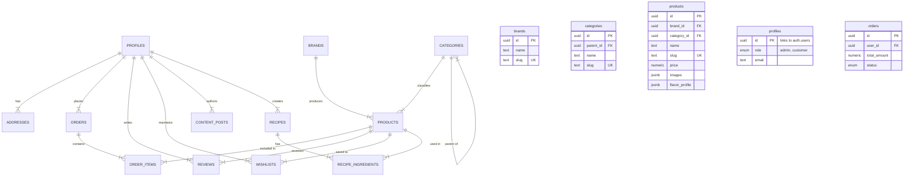

# Balisan Database Schema Documentation

## Overview
This document outlines the PostgreSQL database schema for the Balisan e-commerce platform. The schema is normalized and designed for scalability, security (RLS), and performance.

## Entity Relationship Diagram (ERD)

## Tables & Domains

### 1. Catalog
- **`brands`**: Manufacturers/Distilleries.
- **`categories`**: Hierarchical classification (e.g., Spirits -> Whiskey -> Scotch).
- **`products`**: Core item table. Uses JSONB for flexible Attributes like `images` and `flavor_profile` to accommodate different product types without massive column sprawl.

### 2. Identity
- **`profiles`**: Extends Supabase `auth.users`. Handled via Trigger (`on_auth_user_created`).
    - **Roles**: `admin`, `customer`, `staff`.
- **`addresses`**: User shipping/billing addresses.

### 3. Commerce
- **`orders`**: Transactional record. Stores snapshots of addresses (JSONB) to preserve history even if user updates their profile address.
- **`order_items`**: Line items. Stores snapshots of product details (`price`, `name`) at time of purchase.

### 4. Content & Social
- **`reviews`**: User generated ratings. Restricted to one per product per user.
- **`content_posts`**: Blog and Journal entries.
- **`recipes`**: Cocktail recipes with shoppable ingredients.

## Security (RLS)

All tables have RLS enabled.

| Domain       | Table                              | Policy Summary                                 |
| :----------- | :--------------------------------- | :--------------------------------------------- |
| **Catalog**  | `products`, `brands`, `categories` | **Public Read**. Admin Write.                  |
| **Identity** | `profiles`                         | **Public Read**. User Update Own. Admin All.   |
| **Identity** | `addresses`                        | **Private** (User/Admin only).                 |
| **Commerce** | `orders`, `order_items`            | **Private** (User Read/Create Own). Admin All. |
| **Social**   | `reviews`                          | **Public Read**. User Write Own.               |
| **Social**   | `wishlists`                        | **Private** (User/Admin only).                 |
| **Content**  | `content_posts`, `recipes`         | **Public Read** (if published). Admin All.     |

## Indexing Strategy
- **Primary Keys**: UUID (gen_random_uuid).
- **Foreign Keys**: Indexed for join performance (`category_id`, `brand_id`, `user_id`).
- **Search**: GIN Index on `products(name, description)` for text search.
- **Sorting**: Indexes on `price`, `rating`, `created_at` for product listing pages.
