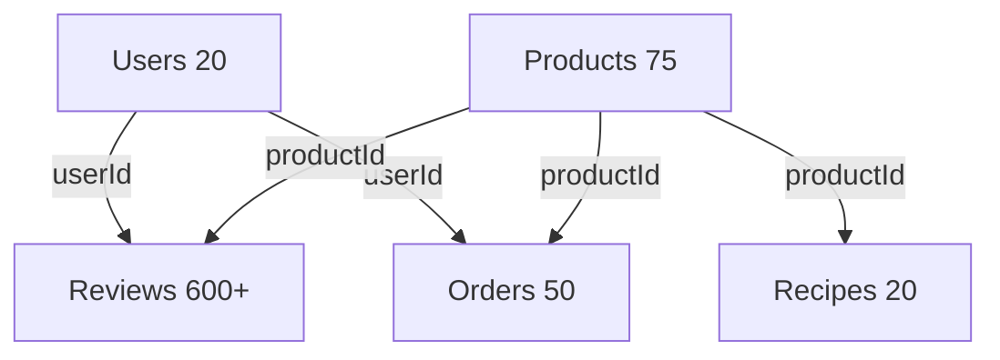

# Balisan Mock Data

Comprehensive mock data for the Balisan Liquor Store e-commerce application, including products, users, orders, reviews, blog content, and cocktail recipes.

## 📊 Data Overview

| Entity         | Count | Description                                                 |
| -------------- | ----- | ----------------------------------------------------------- |
| **Products**   | 75    | Spirits, wine, beer, and liqueurs across 8 categories       |
| **Users**      | 20    | VIP, regular, and new customers with full profiles          |
| **Orders**     | 50    | Historical orders with various statuses over 6 months       |
| **Reviews**    | 600+  | Product reviews with realistic rating distributions         |
| **Blog Posts** | 15    | Full articles on tasting guides, recipes, and industry news |
| **Recipes**    | 20    | Cocktail recipes with shoppable ingredients                 |

## 🗂️ Data Structure

```
/src/data/mock/
├── products.ts           # Whiskey products (15)
├── products-spirits.ts   # Vodka, Rum, Gin, Tequila (45)
├── products-beverages.ts # Wine, Beer, Liqueurs (40)
├── users.ts              # Customer profiles (20)
├── orders.ts             # Order history (50)
├── reviews.ts            # Product reviews (600+)
├── blog-posts.ts         # Journal articles (15)
├── recipes.ts            # Cocktail recipes (20)
├── index.ts              # Central export with helpers
└── README.md             # This file
```

## 🚀 Usage Examples

### Import All Data

```typescript
import { 
  ALL_PRODUCTS,
  USERS,
  ORDERS,
  REVIEWS,
  BLOG_POSTS,
  RECIPES
} from '@/data/mock'
```

### Using Helper Functions

```typescript
import {
  getProductById,
  getProductBySlug,
  getProductsByCategory,
  getFeaturedProducts,
  getNewArrivals,
  searchProducts,
  getReviewsByProductId,
  getOrdersByUserId,
  getBlogPostBySlug,
  getRecipesByDifficulty
} from '@/data/mock'

// Get a specific product
const product = getProductById('wh-001')

// Get whiskey products
const whiskeys = getProductsByCategory('whiskey')

// Get featured products for homepage
const featured = getFeaturedProducts(10)

// Search products
const results = searchProducts('bourbon')

// Get product reviews
const reviews = getReviewsByProductId('wh-001')

// Get user's orders
const userOrders = getOrdersByUserId('user-001')

// Get blog post
const post = getBlogPostBySlug('ultimate-guide-whiskey-tasting')

// Get easy cocktail recipes
const easyRecipes = getRecipesByDifficulty('easy')
```

### Component Integration

```typescript
// In a Product Listing Page
import { ALL_PRODUCTS } from '@/data/mock'

export default function ShopPage() {
  return (
    <div className="grid grid-cols-4 gap-6">
      {ALL_PRODUCTS.map(product => (
        <ProductCard key={product.id} product={product} />
      ))}
    </div>
  )
}

// In a Product Detail Page
import { getProductById, getReviewsByProductId } from '@/data/mock'

export default function ProductPage({ params }: { params: { id: string } }) {
  const product = getProductById(params.id)
  const reviews = getReviewsByProductId(params.id)
  
  return (
    <div>
      <ProductDetails product={product} />
      <ReviewsList reviews={reviews} />
    </div>
  )
}
```

## 📦 Product Data

### Categories (75 total products)

- **Whiskey** (15): Scotch, Bourbon, Irish, Japanese, Canadian
- **Vodka** (15): Premium, craft, international brands
- **Rum** (10): White, dark, spiced, aged varieties
- **Gin** (10): London Dry, contemporary, botanical-forward
- **Tequila** (10): Blanco, Reposado, Añejo expressions
- **Wine** (30): Red (15), White (10), Rosé (5)
- **Beer** (5): IPAs, stouts, lagers, craft selections
- **Liqueurs** (5): Coffee, orange, herbal, fruit liqueurs

### Product Fields

```typescript
interface Product {
  id: string                 // Unique ID (e.g., "wh-001")
  name: string               // Product name
  slug: string               // URL-friendly slug
  brand: string              // Brand name
  price: number              // Regular price
  discountPrice?: number     // Sale price (optional)
  rating: number             // Average rating (1-5)
  image: string              // Main product image
  images: string[]           // Gallery images
  inStock: boolean           // Availability
  stockQuantity: number      // Inventory count
  category: string           // Primary category
  subcategory?: string       // Subcategory (optional)
  description: string        // Product description
  tastingNotes?: string      // Flavor profile
  abv: number                // Alcohol by volume %
  volume: string             // Bottle size (e.g., "750ml")
  region: string             // Production region
  country: string            // Country of origin
  sku: string                // Stock keeping unit
  tags: string[]             // Searchable tags
  reviewCount: number        // Number of reviews
  createdAt: string          // ISO date string
}
```

### Special Product Collections

- **On Sale**: Products with `discountPrice` set
- **Out of Stock**: ~3 products marked as `inStock: false`
- **Premium**: High-end items ($150+)
- **New Arrivals**: Products created in past 3 months
- **Bestsellers**: High review counts (100+)

## 👥 User Data

### Customer Types

- **VIP** (5): High-value customers with extensive order history
- **Regular** (10): Returning customers with moderate activity
- **New** (5): Recently registered, few or no orders

### User Fields

All users are `ageVerified: true` for compliance.
Each user has 1-2 saved addresses with full details.
Order history references actual order IDs from ORDERS dataset.

## 📦 Order Data

### Order Statuses

| Status         | Count | Description              |
| -------------- | ----- | ------------------------ |
| **Delivered**  | ~28   | Completed orders         |
| **Shipped**    | ~10   | In transit with tracking |
| **Processing** | ~6    | Being prepared           |
| **Pending**    | ~4    | Payment confirmed        |
| **Cancelled**  | ~2    | Cancelled orders         |

### Order Timeline

- Distributed over past 6 months
- Realistic date progressions
- Tracking numbers for shipped/delivered orders
- Tax calculations (8-10% based on state)
- Free shipping on orders over $100

## ⭐ Review Data

### Rating Distribution

Approximately follows realistic e-commerce patterns:
- **5 stars**: ~60%
- **4 stars**: ~25%
- **3 stars**: ~10%
- **2 stars**: ~3%
- **1 star**: ~2%

### Review Features

- **Verified Purchases**: ~80% of reviews
- **Helpful Votes**: Randomized 0-50 per review
- **Realistic Content**: Templates for each star rating
- **Product Coverage**: Popular products have 15-40 reviews, premium products have 3-10

## 📚 Blog Posts

### Categories

- **Tasting Guides**: How-to articles on tasting spirits
- **Cocktail Recipes**: Mixology guides and techniques
- **Brand Stories**: Deep dives into distilleries and regions
- **Industry News**: Trends and innovations
- **Seasonal Picks**: Holiday and seasonal content
- **Education**: Basics of spirits and production

### Content Features

- Full markdown-formatted articles (500-800 words)
- Author profiles with avatars
- Featured images
- Read time estimates (5-8 minutes)
- Tags for filtering and SEO
- Publication dates spread over past year

## 🍸 Recipe Data

### Recipe Features

- **20 Classic Cocktails**: Old Fashioned, Margarita, Negroni, etc.
- **Shoppable Ingredients**: Many link to actual product IDs
- **Step-by-Step Instructions**: Clear, numbered steps
- **Difficulty Levels**: Easy (12), Medium (6), Hard (2)
- **Prep Times**: 2-5 minutes average
- **Proper Garnishing**: Glassware and garnish specifications
- **High-Quality Images**: Cocktail photography

## 🔗 Data Relationships



### Referential Integrity

- All `userId` references in Orders and Reviews exist in USERS
- All `productId` references in Reviews and Recipes exist in ALL_PRODUCTS
- Users' `orderHistoryIds` match actual order IDs
- Recipe ingredients with `productId` reference real products

### Validation

Run the built-in validator:

```typescript
import { validateMockData } from '@/data/mock'

const { valid, errors } = validateMockData()
console.log(valid ? '✅ Valid' : '❌ Errors:', errors)
```

## 🔍 Algolia Integration

The product data structure is compatible with Algolia search indexing:

```typescript
// Example: Index products to Algolia
import { ALL_PRODUCTS } from '@/data/mock'
import { searchClient } from '@/lib/algolia'

const index = searchClient.initIndex('products')

await index.saveObjects(ALL_PRODUCTS.map(product => ({
  objectID: product.id,
  ...product
})))
```

### Searchable Attributes

Configure in Algolia:
- `name`
- `brand`
- `description`
- `tags`
- `category`
- `region`

### Facets

- `category`
- `brand`
- `region`
- `tags`
- `inStock`

## 📈 Statistics

Access data statistics:

```typescript
import { MOCK_DATA_STATS } from '@/data/mock'

console.log(MOCK_DATA_STATS)
// {
//   products: { total: 75, byCategory: {...}, inStock: 72, discounted: 4 },
//   users: { total: 20, vip: 5, regular: 10, new: 5 },
//   orders: { total: 50, byStatus: {...}, totalRevenue: 15234.56, averageOrderValue: 304.69 },
//   reviews: { total: 600+, verified: 480+, byRating: {...}, averageRating: 4.5 },
//   blogPosts: { total: 15, categories: 6 },
//   recipes: { total: 20, byDifficulty: { easy: 12, medium: 6, hard: 2 } }
// }
```

## 🎨 Edge Cases Included

- **Out of Stock**: Few products with `stockQuantity: 0`
- **Discounted Items**: Products with reduced prices
- **New Customers**: Users with no order history
- **Cancelled Orders**: Orders with cancelled status
- **No Reviews**: Some products without reviews
- **Premium Pricing**: High-end items ($400-900)
- **Low Stock**: Items with limited quantities

## 🔧 Extending the Data

### Adding Products

```typescript
// In products.ts or create new category file
export const NEW_PRODUCTS: Product[] = [
  {
    id: "new-001",
    name: "New Product",
    // ... other required fields
  }
]

// Add to index.ts
export const ALL_PRODUCTS = [
  ...WHISKEY_PRODUCTS,
  ...NEW_PRODUCTS
]
```

### Adding Users

Similar pattern in `users.ts` - ensure `ageVerified: true`

### Adding Orders

Ensure `userId` references exist and items reference valid products

## 📝 Compliance Notes

- All users have `ageVerified: true` (legal requirement)
- ABV% included on all alcoholic products
- Regional information for regulatory purposes
- Volume/size clearly specified

## 🎯 Best Practices

1. **Import from index**: Always use `@/data/mock` not individual files
2. **Use helper functions**: Leverage built-in queries instead of manual filtering
3. **Validate data**: Run `validateMockData()` during development
4. **Check statistics**: Use `MOCK_DATA_STATS` to verify data integrity
5. **Type safety**: All data conforms to TypeScript interfaces in `@/types`

## 🚀 Next Steps

- **Database Seeding**: Use this data to seed a real database
- **API Mocking**: Wrap in API route handlers for realistic development
- **Algolia Indexing**: Index products for search functionality
- **Image Replacement**: Replace Unsplash URLs with actual product photos
- **Content Expansion**: Add more blog posts and recipes as needed

---

**File Size**: ~3.5MB total  
**Total Records**: 780+  
**Last Updated**: 2025-12-30

For questions or issues, refer to the implementation plan or contact the development team.
